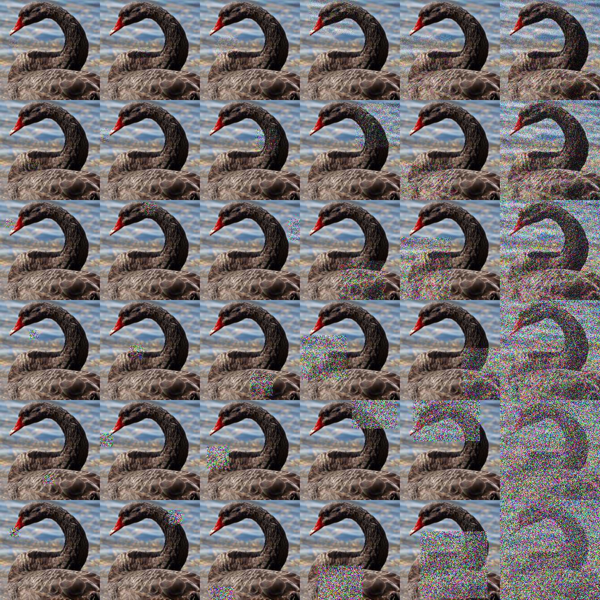

# Patch Gaussian

This is an unofficial pytorch implementation of Patch Gaussian augmentation which is proposed in the paper, [Improving Robustness Without Sacrificing Accuracy with Patch Gaussian Augmentation [Lopes+, ArXiv 2019]](https://arxiv.org/abs/1906.02611).

Patch Gaussian is a simple augmentation scheme that adds noise to randomly selected patches in an input image. This simple augmentation help to overcome the trade-off between robustness and accuracy.



## Requirements

You will need the following to run the codes:
- Python 3.7+
- PyTorch 1.4+
- TorchVision
- numpy
- tqdm

Note that I run the code with Ubuntu 18, Pytorch 1.4.0, CUDA 10.1.

## Usage

### Generating Sample Image

By running `patch_gaussian.py`, you will be able to obtain a sample image like the teaser image of this repo.
If you want to apply Patch Gaussian to an other image, please specify options as follows.

Example code:

```
python patch_gaussian.py -i [IMAGE_PATH] -o [OUTPUT_PATH]
``` 

### Adding Patch Gaussian to your augmentation

If you want to add Patch Gaussin augmentation to your training, you can to `AddPatchGaussian`  class in `patch_gaussian.py`. 
This class is able to use as same as classes in `torchvision.transforms`  (e.g. `torchvision.transforms.CenterCrop`  or `torchvision.transforms.ToTensor` , etc.).